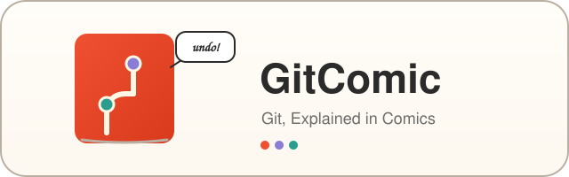

# GitComic — Git, Explained in Comics

> **A comic-book product line that teaches Git to non-technical builders in the AI era.**
> Produced by [Wright](https://github.com/xhqing/ProductProducerAgent) (the digital-product producer agent of the [xhqing AI agent team](https://github.com/xhqing)); this repo is a sub-project of ProductProducerAgent.

[简体中文](README_cn.md)

---

## The Product Line

**Git: The Comic — Your Undo Button for the AI Era** (中文版《Git 漫画书：AI 时代的后悔药》) — a comic-style illustrated ebook for *vibe-coding* non-technical users (founders, indie workers, product/design/ops folks who let AI write their code but have no version control). Current deliverables (v0.2.1, preview stage):

| Product | product_id | Form |
|---|---|---|
| Git: The Comic (preview) | `Git-Comic-v1` | 20-page preview PDF, EN & ZH editions |
| Git-Comic-Mini | `Git-Comic-Mini` | 10 vertical cards (1080×1350, Instagram / RED-ready), EN & ZH editions |

Strategy: preview-first validation — ship the 20-page preview, measure engagement, then greenlight the full 80–120 page book (a separate task, pending validation results).

## Why This Repo Tracks So Little

The product itself (source assets, finished PDFs, cards, delivery zips, and the Product Spec) lives in this repo's **`artifacts/` directory, which is git-ignored on purpose**: paid products never enter a public repository. The spec (`artifacts/git-comic-spec.md`, local only) holds product ids, pricing, delivery, acceptance records, and the pipeline interface. What git tracks here is the product line's documentation and history.

## How It's Made

Chinese storyboard finalized first → one storyboard, two language editions (EN/ZH structurally identical, semantically aligned). Art pipeline: **Agnes AI** base illustrations (character reference images locked via multi-image composition for cross-page consistency) + an SVG typesetting layer for speech bubbles / narration / terminal boxes → Chrome headless prints the PDF (~5.5 MB per language), rsvg-convert renders the PNG cards. Full details in the local spec.

## Pipeline Position

① Scout (research) → ② **Wright** (produce, this repo) → ③ Mason (landing + payment) → ④ Buzz (traffic) → ⑤ Vendy (sell & fulfill) → ⑥ Echo (attribution via `product_id`)

## License & Attribution

- Project URL: https://github.com/xhqing/GitComic
- Copyright (c) 2026 All Contributors. Repo documentation is licensed under [MIT](LICENSE.md).
- The product contents themselves (PDFs, card images, source/storyboard assets) are **not** covered by this open license — they are commercial deliverables and are not distributed in this repository.
- When referencing this project, please keep the copyright notice and cite the source.
